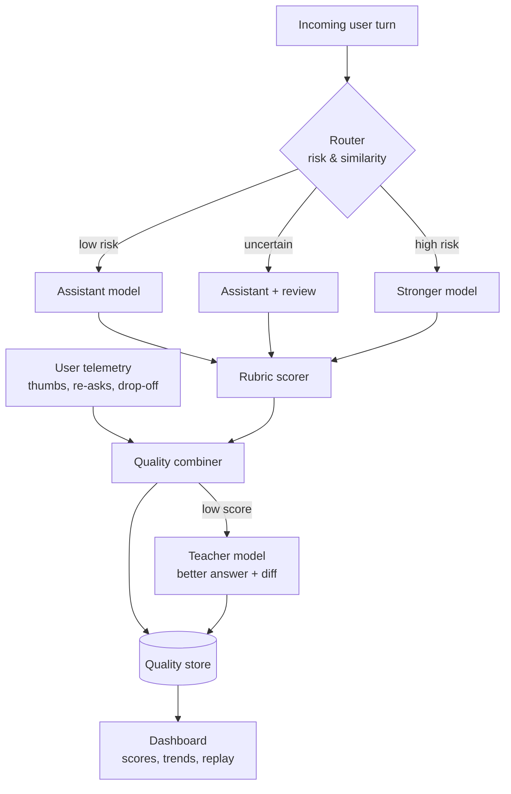
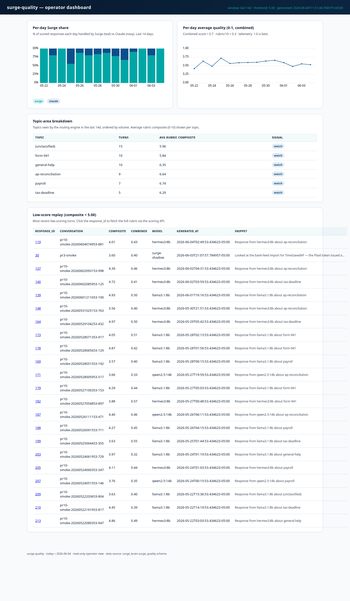

<!-- Copyright © 2026 SurgeXi Business Intelligence, a Teamsmith Enterprises LLC company. All Rights Reserved. -->
# surge-quality

> A quality-measurement and routing layer for LLM assistants — score every response on a rubric, fold in real user signals, and route the next turn to the model that can handle it.

[](https://github.com/SurgeXi/surge-quality/actions/workflows/ci.yml)
[](LICENSE)
[](pyproject.toml)

Handing customer-facing conversations to an AI assistant is only safe if you can
**measure whether the assistant is actually good**. surge-quality is a FastAPI
service that scores each assistant response on a multi-axis rubric, captures the
signals real users give off (thumbs, re-asks, drop-off, escalation), combines the
two into one quality score, and uses that history to route incoming turns —
assistant-only, assistant-with-review, or straight to a stronger model — based on
how risky the turn looks. When a response scores low, a stronger "teacher" model
is invoked to produce a better answer plus a what-was-wrong diff, both logged as
training data so the loop closes.

## Architecture





*Live quality telemetry: per-conversation scores, risk-tier routing, and teacher-in-the-loop signals.*

## Features

- **Rubric scoring** — every response is graded on a multi-axis rubric (correctness, tone, completeness, action-orientation, brevity, citation quality, safety, confidence calibration, and more).
- **User telemetry ingestion** — captures behavioral signals from the chat surface: thumbs, reply latency, drop-off, re-asks, and explicit escalation requests.
- **Combined quality score** — merges the rubric judgment with real-world signals into a single per-response number you can trend and alert on.
- **Teacher-in-the-loop** — low-scoring responses trigger a stronger model to generate a corrected answer and a diff explaining the failure; both are logged as training data.
- **Risk-aware routing** — routes each incoming turn by similarity to past low-scoring turns, topic complexity, urgency, and context.
- **Dashboard** — assistant-share %, average score, topic breakdown, and low-score replay (Grafana panels, with a self-contained HTML fallback included).

## Quick start

```bash
git clone https://github.com/SurgeXi/surge-quality.git
cd surge-quality

python3.12 -m venv .venv && . .venv/bin/activate
pip install -e .[dev]

# Point at a Postgres database and apply migrations
export DATABASE_URL="postgresql+psycopg2://sq:sq@localhost:5432/surge_quality"
alembic upgrade head

uvicorn surge_quality.main:app --host 127.0.0.1 --port 9310 --reload
```

Run the tests:

```bash
pytest -q tests/unit
```

## Configuration

Configuration is environment-driven (`pydantic-settings`). Key values:

Settings use the `SURGE_QUALITY_` env prefix, with a few ergonomic unprefixed
aliases:

| Variable | Purpose |
|----------|---------|
| `DATABASE_URL` | Postgres connection string for the quality store |
| `ANTHROPIC_API_KEY` | Credential for the stronger "teacher" model used on low-score turns |
| `SURGE_QUALITY_SERVICE_TOKEN` | Service token authenticating callers to the API |
| `SURGE_QUALITY_PORT` | Listen port (default `9310`) |

The scoring model and the teacher model are pluggable behind client interfaces
(`scoring/` and `reviewer/`), so you can swap in a local model for scoring and a
frontier model for teaching without touching the rest of the service.

## Design notes

The core idea is that **"is the assistant good enough to trust with customers?"
is a measurable question, not a gut call.** Two design choices make the answer
trustworthy:

1. **Two independent quality sources.** A rubric score from a judging model can
   be gamed or biased; raw user telemetry is noisy and sparse. Combining them
   guards against both — a response has to satisfy the rubric *and* not make
   real users bounce or re-ask.
2. **Every low score becomes training data.** When a response falls short, the
   teacher model doesn't just fix it in the moment — it emits a structured
   diff of what was wrong. That turns quality monitoring into a continuous
   improvement loop rather than a passive dashboard.

Routing is treated as a dial, not a switch: turns that look similar to past
failures, or that are high-stakes, are escalated to a stronger model or to
human/assistant review, while routine turns stay on the cheaper path. Quality
gating decides *when* the assistant is allowed to answer alone, per topic, as
the evidence accumulates.

## Roadmap

- [ ] Per-topic quality thresholds that auto-adjust the routing dial
- [ ] Calibration report comparing rubric scores against user outcomes
- [ ] Configurable telemetry adapters for additional chat surfaces
- [ ] Exportable training-data bundles from the teacher loop

## License
© 2026 SurgeXi Business Intelligence, a Teamsmith Enterprises LLC company. All Rights Reserved.
Source-available for evaluation only — see LICENSE.

